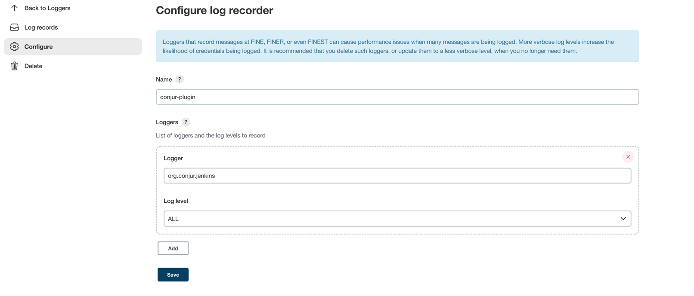

# Demo project for Conjur integration with Jenkins

## Pre-requisites
- OS Linux / MacOS
- podman
- conjur-cli
## Jenkins Setup
```shell
./load-jenkins-policies.sh
```

## To debug
```shell
docker logs --since=2m dap | grep "Authentication Error"
```
